<html><head><meta content="text/html; charset=UTF-8" http-equiv="content-type">

</head><body class="c69">

<h1 class="c32" id="h.p5to7231u73y">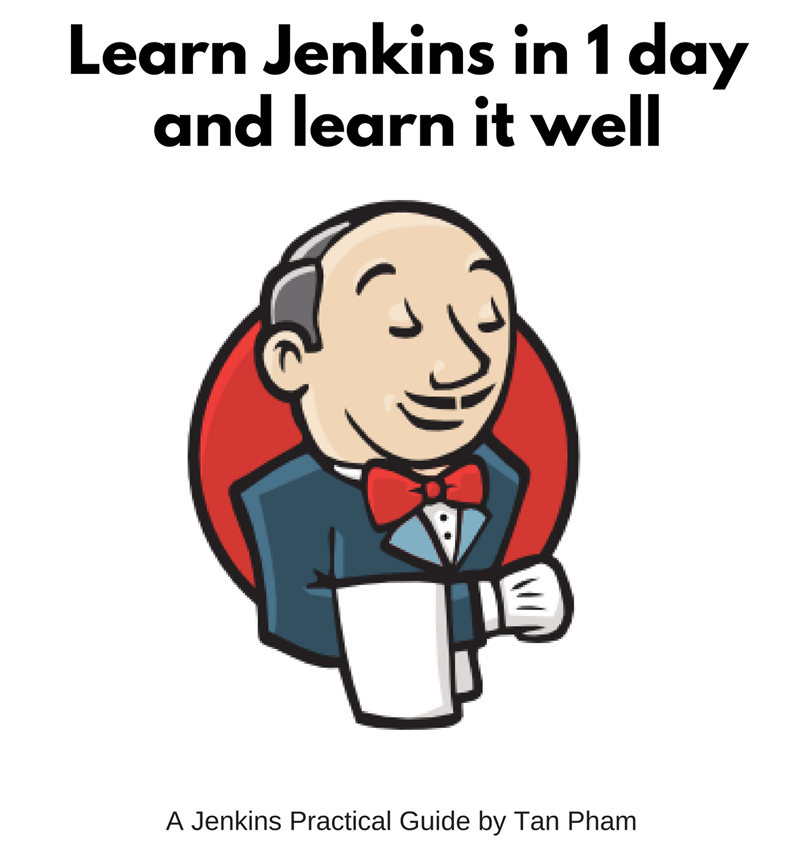</h1>

<a class="c16" href="#h.go2wkkw9sfp6">Jenkins Installation</a>

<a class="c16" href="#h.oww9bssash2g">Jenkins on Windows</a>

<a class="c16" href="#h.dr2taumwzit4">Jenkins on Ubuntu</a>

<a class="c16" href="#h.6yln31gtgjxr">Jenkins on Mac</a>

<a class="c16" href="#h.df68qw5m1y51">Jenkins the Basic</a>

<a class="c16" href="#h.6s7s4plb855q">Jenkins in the Big Picture of CI, CD and DevOps</a>

<a class="c16" href="#h.l73mzspyrmwg">Create &nbsp;&ldquo;Hello world&rdquo; Job</a>

<a class="c16" href="#h.dxh3i95vy0zr">Add Build Step</a>

<a class="c16" href="#h.d0jzygfl9ggi">Start the First Build</a>

<a class="c16" href="#h.3xkw1quwp5rh">Console Output</a>

<a class="c16" href="#h.5an0jsi6p0pm">Intro GOL Demo Project (a Java Maven Project)</a>

<a class="c16" href="#h.wzp2icx0qjfi">Github Repository</a>

<a class="c16" href="#h.9s2y2cstwyjr">Maven Pom File Structure</a>

<a class="c16" href="#h.1jvcyr5ke0rq">How GOL Look Like after Deploy to Application Server</a>

<a class="c16" href="#h.iy9gg72smteg">Continuous Integration with Jenkins</a>

<a class="c16" href="#h.upxm9kk9li6g">Create GOL Job</a>

<a class="c16" href="#h.51gxa5vnxykn">Source Code Management</a>

<a class="c16" href="#h.2fvskibuhyn3">Check if git is installed in local machine</a>

<a class="c16" href="#h.hs33iab4lu4t">Specify source code repository</a>

<a class="c16" href="#h.l6m22ps0eeyl">Check if setting working fine</a>

<a class="c16" href="#h.5ey6ujjqtiq0">Build Triggers</a>

<a class="c16" href="#h.22ikuqy0seqi">Build</a>

<a class="c16" href="#h.w1ad2xfp4isa">Maven installation</a>

<a class="c16" href="#h.c4mujaylvh6a">Try to run maven build manually</a>

<a class="c16" href="#h.qaqlgqakhyub">Configure Build Step</a>

<a class="c16" href="#h.ad9nx4qxzuh7">Check Log and Workspace</a>

<a class="c16" href="#h.ibq1865hb893">Continuous Inspection with Jenkins</a>

<a class="c16" href="#h.an52ieq52j86">Job Configure for Test Report</a>

<a class="c16" href="#h.qq75ugi9gsc1">Test Report on Job Dashboard</a>

<a class="c16" href="#h.h4wtunn3nnwl">Continuous Delivery with Jenkins</a>

<a class="c16" href="#h.jbswqov5xizr">Install Tomcat Server as Service</a>

<a class="c16" href="#h.y0d2en4gymp0">Install &ldquo;Deploy to Container Plugin&rdquo;</a>

<a class="c16" href="#h.l2b3bds58ork">Add Deploy Step</a>

<a class="c16" href="#h.dv7s5lft0k36">Check if Deploy Step Run Successfully</a>

<a class="c16" href="#h.wvt3qwwjai02">Continuous Monitoring with Jenkins</a>

<a class="c16" href="#h.q1nswudt489k">Create Slack Team and Install Jenkins CI App</a>

<a class="c16" href="#h.qeamhq3pzti5">Install Slack Notification Plugin to Jenkins</a>

<a class="c16" href="#h.o966bnjqympg">Configure GOL Using Slack Notification</a>

<a class="c16" href="#h.pac8aq9og0rv">Check if Notification Work</a>

<a class="c16" href="#h.9nd9xxh92qz6">Distributed Build System with Jenkins</a>

<a class="c16" href="#h.dltdsbc8vnzz">Jenkins Architecture</a>

<a class="c16" href="#h.6dv54ua2zozk">Windows Slave Agent</a>

<a class="c16" href="#h.gux6ly60yci8">Enable &nbsp;Launch Slave Agents via Java Web Start</a>

<a class="c16" href="#h.aqj2gns6thm6">Add New Windows Slave</a>

<a class="c16" href="#h.k3eoocsovbik">Launch Slave Agent</a>

<a class="c16" href="#h.vyzzycnxwix0">Running Job with Windows Slave Agent</a>

<a class="c16" href="#h.j2isbwu25bnq">Ubuntu Slave Agent</a>

<a class="c16" href="#h.kbsm7r1z9mae">Enable &nbsp;Launch Slave Agents via Java Web Start</a>

<a class="c16" href="#h.tc4f50cdmgts">Add New Ubuntu Slave Agent</a>

<a class="c16" href="#h.c05iotguhszp">Launch Slave Agent</a>

<a class="c16" href="#h.fvsxn7lv8o1i">Jenkins Pipeline</a>

<a class="c16" href="#h.dlab1wfwtguq">What is Jenkins Pipeline ?</a>

<a class="c16" href="#h.xndci758kyb7">Create a Jenkinsfile</a>

<a class="c16" href="#h.quzommg9qo92">Create Pipeline Job</a>

<a class="c16" href="#h.y9v78xmy5d3y">Build with Pipeline</a>

<a class="c16" href="#h.jiehqyh2wg6z">Running Pipeline On Specific Agent</a>

<a class="c16" href="#h.zhw8jm7j338">Deploy to Tomcat with Pipeline</a>

<a class="c16" href="#h.yp3dxge0eqju">Jenkins Security</a>

<a class="c16" href="#h.j7h7946ga4i">Create gol_developer user</a>

<a class="c16" href="#h.rckgyp92zjw9">Matrix-based Security</a>

<a class="c16" href="#h.jcfrawu4kgnb">Role-based Security</a>

<a class="c16" href="#h.mbkjcd1vq7l9">Install Role-based Plugin</a>

<a class="c16" href="#h.2hu4luhd14ac">Configure Global Role</a>

<a class="c16" href="#h.pjpimucrtpt8">Configure Project Role</a>

<a class="c16" href="#h.1oa7n0tz7mvt">Disable Security</a>

<a class="c16" href="#h.q6pveym1l6yj">Jenkins Backup and Restore</a>

<a class="c16" href="#h.pdhk7oa3zpri">Install and Configure ThinBackup Plugin</a>

<a class="c16" href="#h.qu5indkojsl4">Manually Backup</a>

<a class="c16" href="#h.i7rnz89t1f9g">Restore from Backup</a>

<a class="c16" href="#h.gn0x268r1i44">Jenkins Interview Questions</a>

<a class="c16" href="#h.rxyfei3zczhq">Jenkins Interview Question</a>

<a class="c16" href="#h.y2op7uk97x84">What is Jenkins?</a>

<a class="c16" href="#h.xm3vmbdn1rif">What is the requirement for using Jenkins?</a>

<a class="c16" href="#h.fj3wh931blxs">What are the advantages of Jenkins?</a>

<a class="c16" href="#h.yb889sc6opfj">How you can move or copy Jenkins from one server to another?</a>

<a class="c16" href="#h.u6dfeyc3rzxr">What are the commands you can use to start Jenkins manually?</a>

<a class="c16" href="#h.jbd5lu653hpo">How can create a backup and copy files in Jenkins?</a>

<a class="c16" href="#h.fqcc5fhwb8fj">How you can set up Jenkins job?</a>

<a class="c16" href="#h.yjckvfaxrfw">What are the two components Jenkins is mainly integrated with?</a>

<a class="c16" href="#h.t0p0lw4jy909">CI/CD Interview Question</a>

<a class="c16" href="#h.evhryk8qqzd">What is continuous integration?</a>

<a class="c16" href="#h.lzra1pc2fv1s">Why is Continuous Integration important?</a>

<a class="c16" href="#h.r35jvjj9u53x">What are the success factors for Continuous Integration?</a>

<a class="c16" href="#h.cjhsvny4h8le">Special Bonus</a>

<a class="c16" href="#h.s5qim6viyjan">More Reference</a>

<h1 class="c32" id="h.go2wkkw9sfp6">Jenkins Installation</h1>
In this chapter, we will jump into how to install and start up Jenkins in 3 environment : Window, Ubuntu and Mac.

In all environment, Jenkins will be installed as service, it mean Jenkins will automatically start up every time you machine power on or restart machine.
<h2 class="c28" id="h.oww9bssash2g">Jenkins on Windows</h2>
Check if java is installed&nbsp;: Java should be installed in Windows machine, to check if Java is installed, start a command prompt and typing in &nbsp;java -version &nbsp;Java version show up as below. Incase java not yet install, please install java before process to installation.

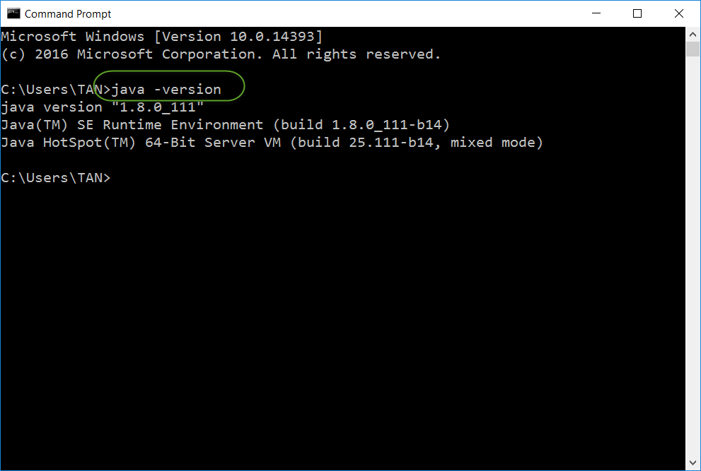

Install process

Step 1&nbsp;: Go to <a class="c16" href="https://www.google.com/url?q=https://jenkins.io/&amp;sa=D&amp;ust=1491492107821000&amp;usg=AFQjCNFFRuoBRZm8YxsZM2GDeYqFlhfzJw">https://jenkins.io/</a>&nbsp;and download for stable version of Jenkins

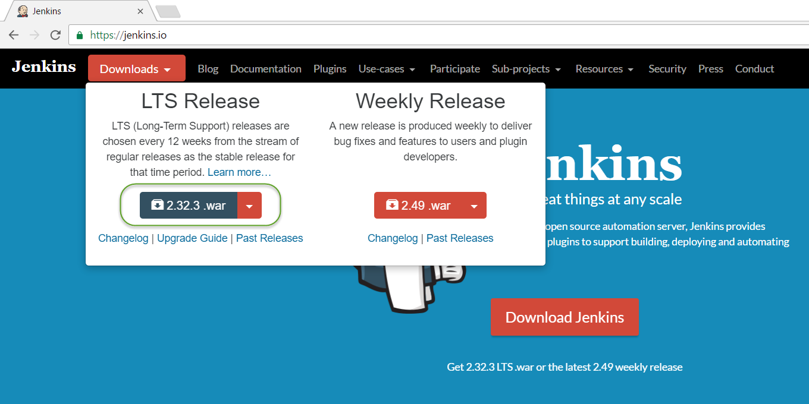

Step 2&nbsp;: Create a new folder for Jenkins (for example C:\Jenkins) and put file jenkins.war inside this folder

&nbsp;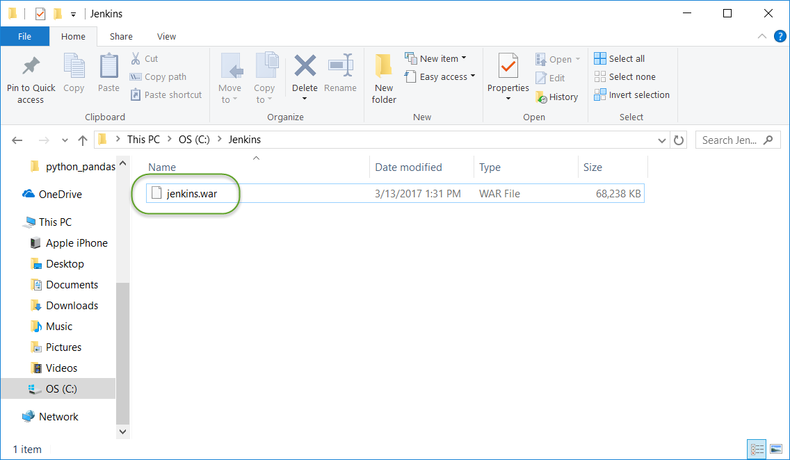

Step 3&nbsp;: Press to shift and right click at same time to open context menu and select Open command window here

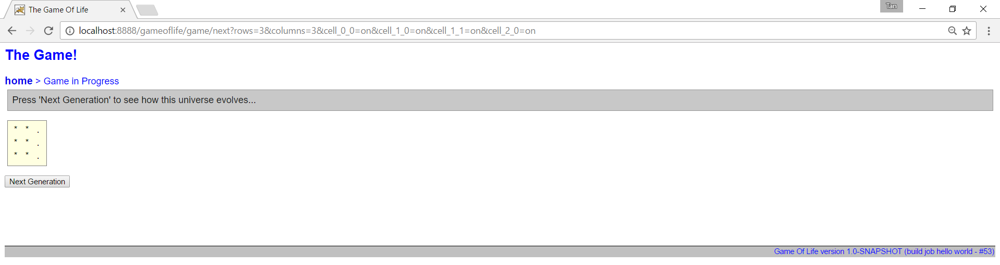

Step 4&nbsp;: Typing in command prompt following to start installation java -jar jenkins.war

Then wait a while for complete running.

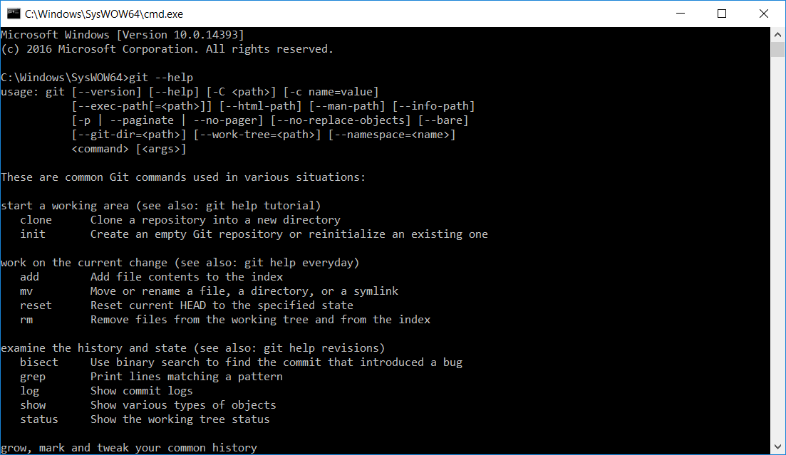

In the output log, you will see default password for first login of admin user, copy this password to notepad and save it for use on next step.

Step 5&nbsp;: Now open browser and access to <a class="c16" href="https://www.google.com/url?q=http://localhost:8080/&amp;sa=D&amp;ust=1491492107837000&amp;usg=AFQjCNF_h8b37jaxHsBTZjnbvkzgABTK1Q">http://localhost:8080</a>&nbsp;and then paste admin password to unlock Jenkins

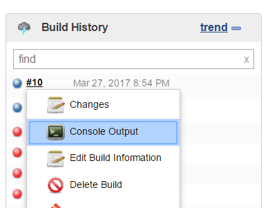

Wait a while and following screen show up, select default option Install suggested plugins

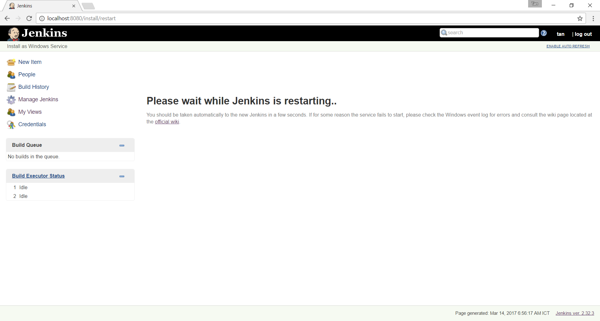

At this step default plugins will be installed.

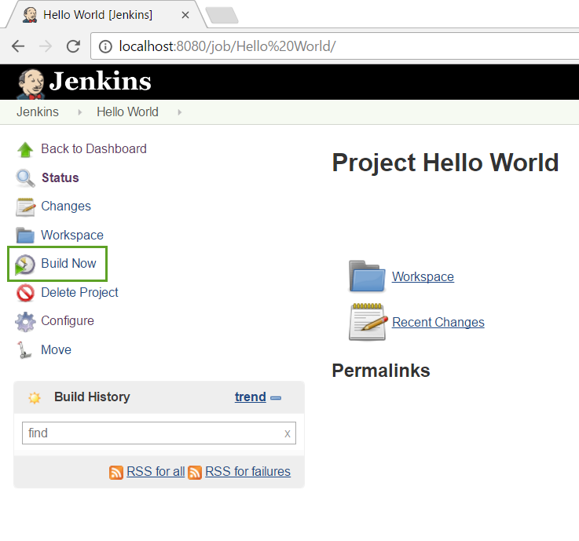

Step 6&nbsp;: Enter your user name, password for a new admin, then click to Save and Finish

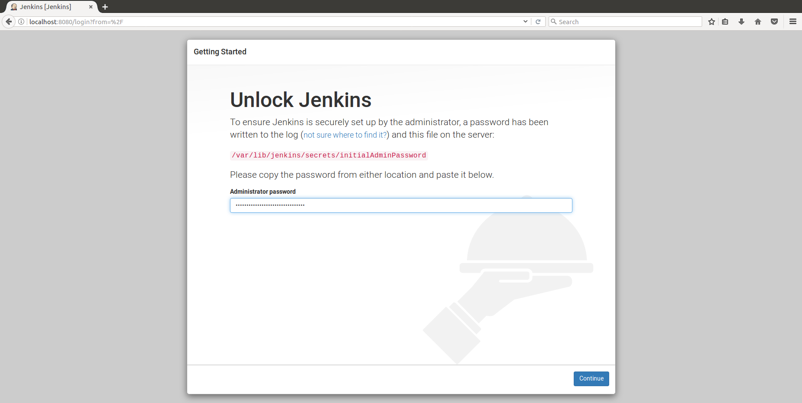

Step 7&nbsp;: Click to Start using Jenkins, Congregation at this step you already complete for Jenkins installation

&nbsp;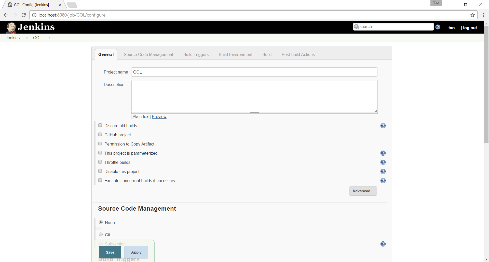

Jenkins auto login by new admin user already created

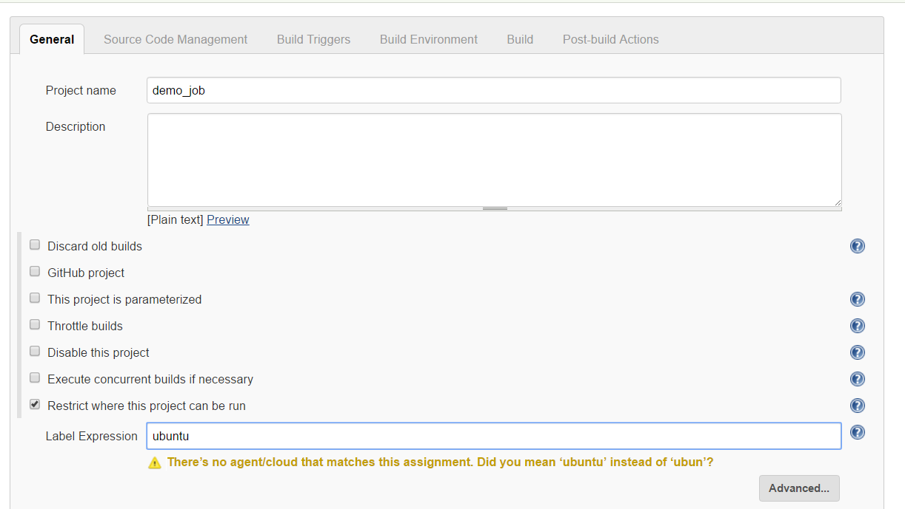

Step 8 : Click to Manage Jenkins from main screen, scroll down and click to Install as Windows Service

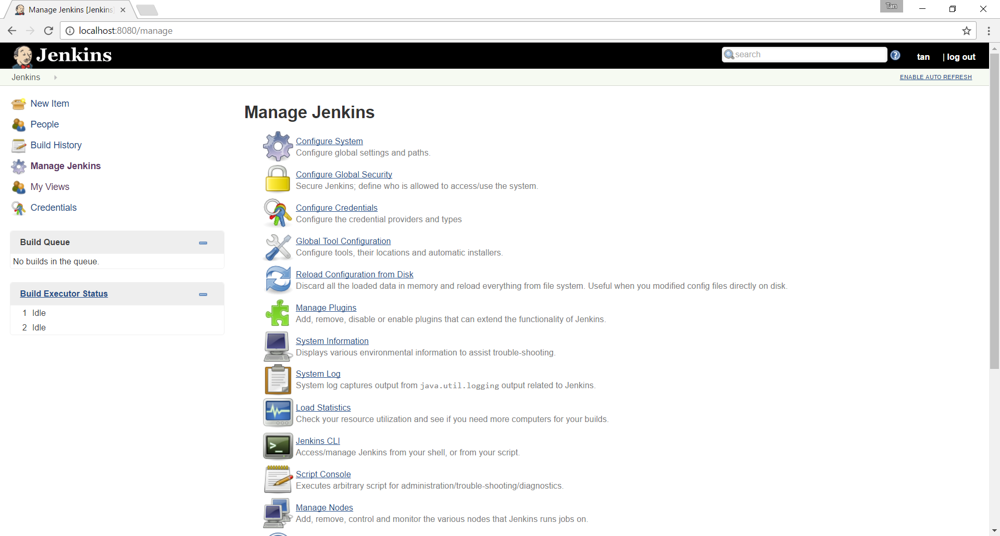

Click to Install

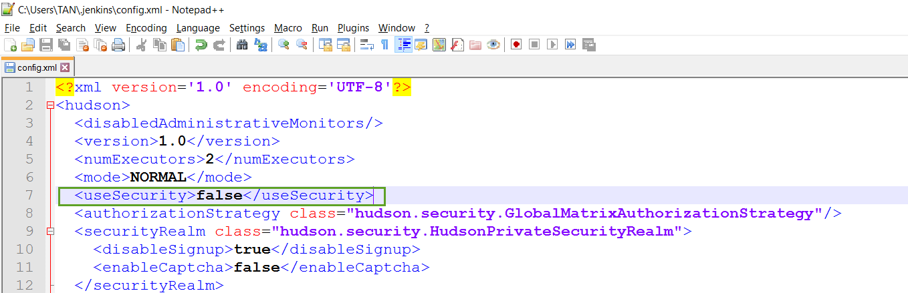

Click to Yes

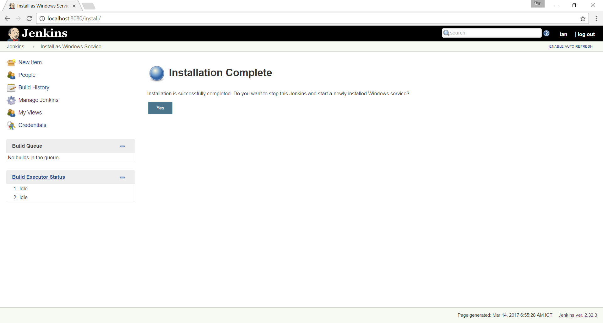

Wait some time and you will see jenkins service is running from windows service manager

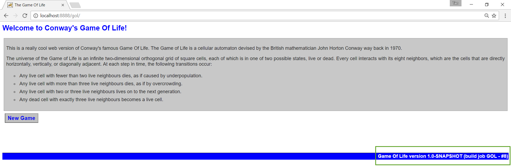

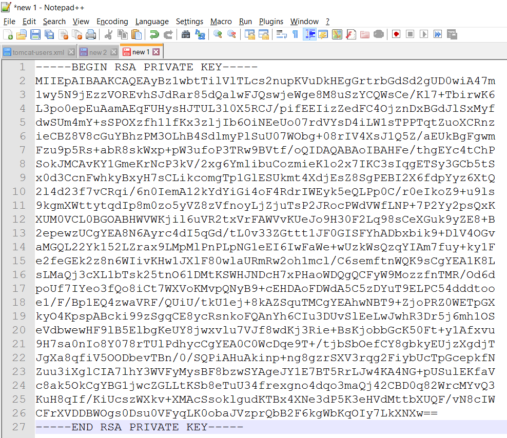

That it, You complete install Jenkins on Windows as service. From now on every time Windows power up or restart, Jenkins will ready to access at <a class="c16" href="https://www.google.com/url?q=http://localhost:8080&amp;sa=D&amp;ust=1491492107863000&amp;usg=AFQjCNENYr3k7a0RS_7KKdYbLBNSX_BJ8w">http://localhost:8080</a>

You can try to login Jenkins with above user created.

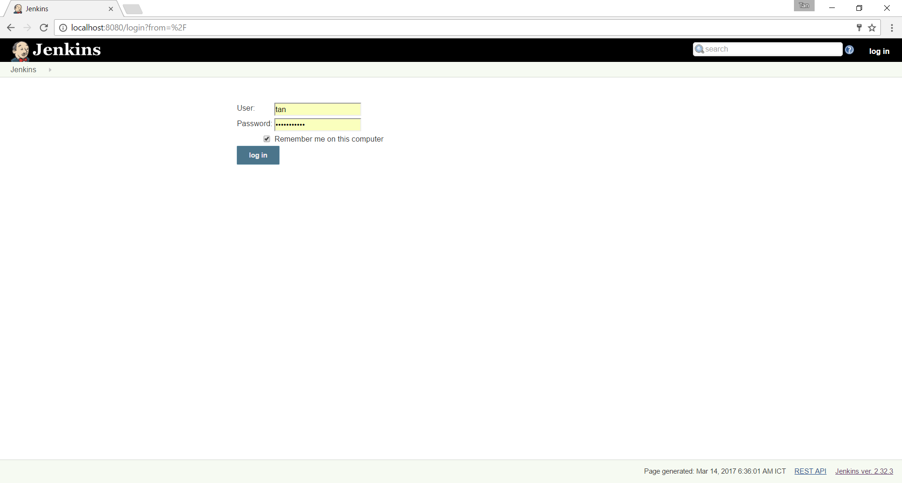

<h2 class="c28" id="h.dr2taumwzit4">Jenkins on Ubuntu</h2>
Check if java is installed

Java should be installed in Ubuntu machine, to check if Java is installed, start a terminal and typing in java -version , If Java already installed, you will see Java version show up.

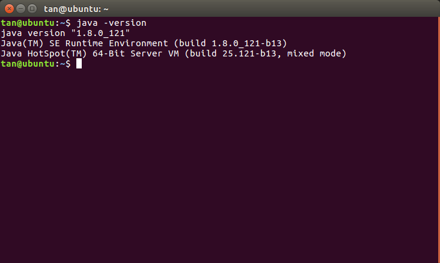

Install Process

Step 1&nbsp;: Open terminal and typing in following command

<table class="c38"><tbody><tr class="c24"><td class="c15" colspan="1" rowspan="1">
wget -q -O - https://pkg.jenkins.io/debian/jenkins-ci.org.key | sudo apt-key add -

 sudo sh -c &#39;echo deb http://pkg.jenkins.io/debian-stable binary/ &gt; /etc/apt/sources.list.d/jenkins.list&#39;

 sudo apt-get update

 sudo apt-get install jenkins
</td></tr></tbody></table>

The above code do following job :
<ul class="c8 lst-kix_3nyzq2xa3qdq-0 start"><li class="c10 c9 c6">Jenkins will be launched as a daemon up on start. See /etc/init.d/jenkins for more details.</li><li class="c10 c9 c6">The &#39;jenkins&#39; user is created to run this service.</li><li class="c10 c9 c6">Log file will be placed in /var/log/jenkins/jenkins.log. Check this file if you are troubleshooting Jenkins.</li><li class="c10 c9 c6">/etc/default/jenkins will capture configuration parameters for the launch like e.g JENKINS_HOME</li><li class="c10 c9 c6">By default, Jenkins listen on port 8080. Access this port with your browser to start configuration.</li></ul>

Step 2&nbsp;: Open the file /var/log/jenkins/jenkins.log&nbsp;and copy the default password which is automate generated during installation

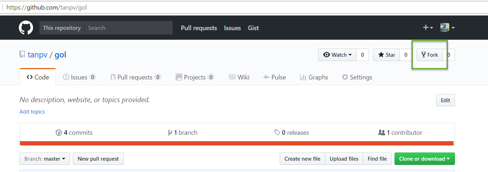

Step 3&nbsp;: Open browser and access to Jenkins at <a class="c16" href="https://www.google.com/url?q=http://localhost:8080/&amp;sa=D&amp;ust=1491492107890000&amp;usg=AFQjCNGkZb3pkT0rHiYPD8qlrlHZklJTBg">http://localhost:8080/</a>&nbsp;then paste the password above to unlock jenkins. Click to Continue&nbsp;button

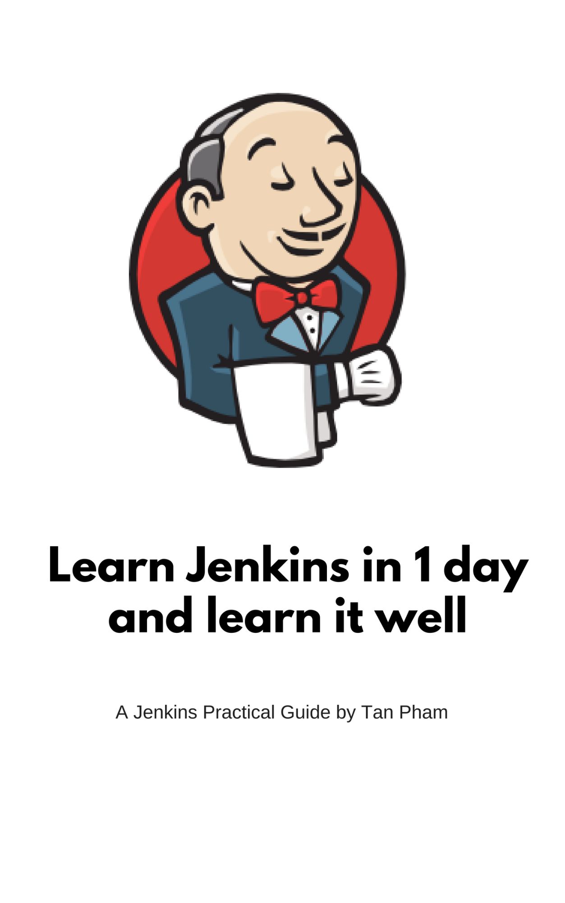

Step 4&nbsp;: Click on Install suggested plugins

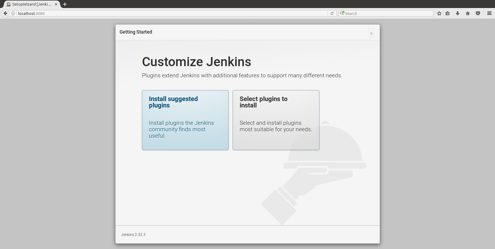

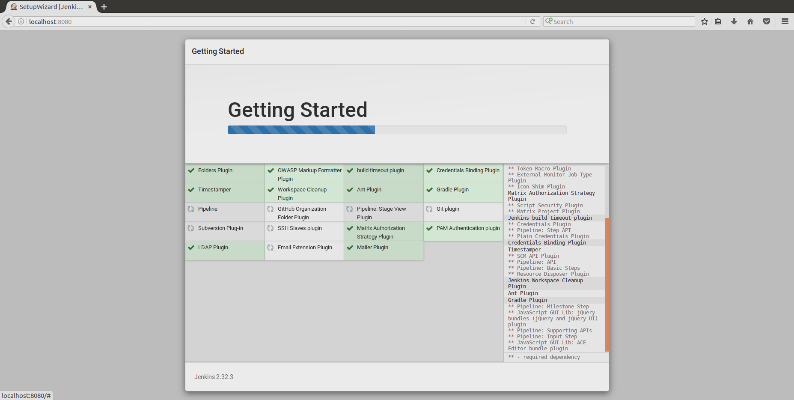

Step 5&nbsp;: Enter your user name, password for a new admin.

Step 6&nbsp;: That it, now jenkins ready to use, click to Start using Jenkins

From now Jenkins already installed in Ubuntu as daemon service, so every time you power on machine, Jenkins will start and ready to access at <a class="c16" href="https://www.google.com/url?q=http://localhost:8080/&amp;sa=D&amp;ust=1491492107904000&amp;usg=AFQjCNFTugNZ-qxLWsFSC-CKVcd2_t7bCA">http://localhost:8080/</a>

<h2 class="c28" id="h.6yln31gtgjxr">Jenkins on Mac</h2>
Step 1&nbsp;: Download installer for Mac from <a class="c16" href="https://www.google.com/url?q=https://jenkins.io/&amp;sa=D&amp;ust=1491492107907000&amp;usg=AFQjCNFdtO4GNi_tj9Wq-Xg6VQ3MxT44uQ">https://jenkins.io/</a>&nbsp;.Then run the installer file.

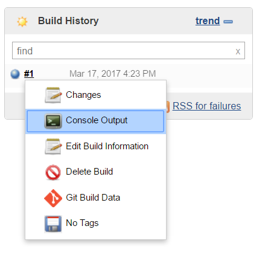

Step 2&nbsp;: After complete install, you access Jenkins at <a class="c16" href="https://www.google.com/url?q=http://localhost:8080/&amp;sa=D&amp;ust=1491492107912000&amp;usg=AFQjCNGLbE2gAHIPeIl-QYQNU7cMW5SLGQ">http://localhost:8080/</a>

Step 3 : Open file /Users/Shared/Jenkins/Home/secrets/initialAdminPassword and copy password use for unlock Jenkins

Step 4&nbsp;: Click on Install suggested plugins

Step 5&nbsp;: Enter your user name, password for a new admin.

Step 6&nbsp;: That it, now jenkins ready to use, click to Start using Jenkins

From now Jenkins already installed in Mac as a service, so every time you power on machine, Jenkins will start and ready to access at <a class="c16" href="https://www.google.com/url?q=http://localhost:8080/&amp;sa=D&amp;ust=1491492107925000&amp;usg=AFQjCNEpuHrH1DnI_44L4uaCkksUlhT-OQ">http://localhost:8080/</a>

<h1 class="c32" id="h.df68qw5m1y51">Jenkins the Basic</h1>
In this section I will explain Jenkins role in the world of continuous integration, continuous delivery and devops. And then we will go through steps in order to create &ldquo;Hello World&rdquo; Jenkins job.
<h2 class="c28" id="h.6s7s4plb855q">Jenkins in the Big Picture of CI, CD and DevOps</h2>
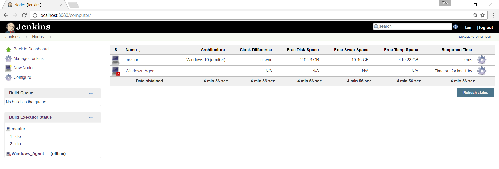

Image&nbsp;above show quite clear about Jenkins role in software development process.
<ul class="c8 lst-kix_3jum4pcrkk24-0 start"><li class="c10 c9 c6">Developer do coding and commit their code to a version control repository like Github</li><li class="c10 c9 c6">Jenkins actively check Github to see any change, in case has code change, Jenkins will pull the last code from Github to build machine (machine which run Jenkins job)</li><li class="c10 c9 c6">Jenkins build software artifact from pulled source code (for example war file from .java source file)</li><li class="c10 c9 c6">Jenkins run and show up unit test report</li><li class="c10 c9 c6">Jenkins deploy artifact to target environment (for example a web server like : Tomcat, JBoss, WebSphere...)</li></ul>

<h2 class="c43" id="h.l73mzspyrmwg">Create &nbsp;&ldquo;Hello world&rdquo; Job</h2>

From Jenkins home page, click to New Item

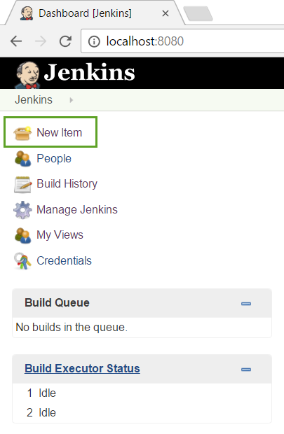

In create project page, typing in &ldquo;Hello World&rdquo; to project name, select Freestyle project and then click to save button.

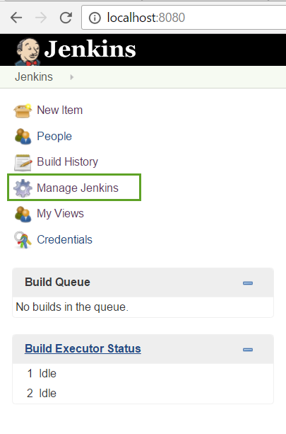

<h2 class="c43" id="h.dxh3i95vy0zr">Add Build Step</h2>
In configure job page, select Build&nbsp;tab, click to Add build step and select Execute Windows batch command (in case you are using Linux please select Execute shell)

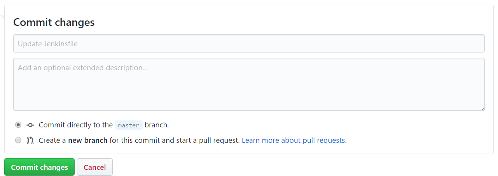

Typing in command &ldquo;echo Hello World&rdquo;. The purpose of this job is just echo to log message &ldquo;Hello World&rdquo; text.

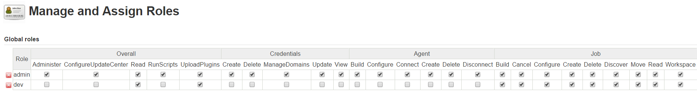

Click Save button and we complete the first job!

<h2 class="c28" id="h.d0jzygfl9ggi">Start the First Build</h2>
From job dashboard, click Build Now and you will see job run. This job just do one thing, invoke the command &ldquo;echo hello world&rdquo;

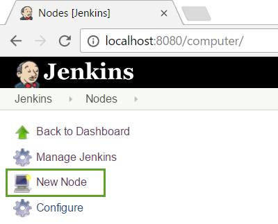

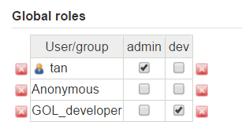

<h2 class="c28" id="h.3xkw1quwp5rh">Console Output</h2>
Now job run completely, click to build number and select Console Output. You will see message &ldquo;Hello World&rdquo; show up inside build log. That it you just complete the first Jenkins job.

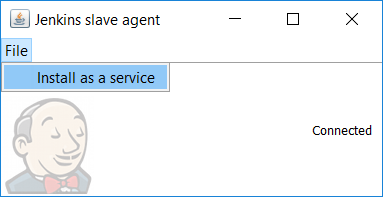

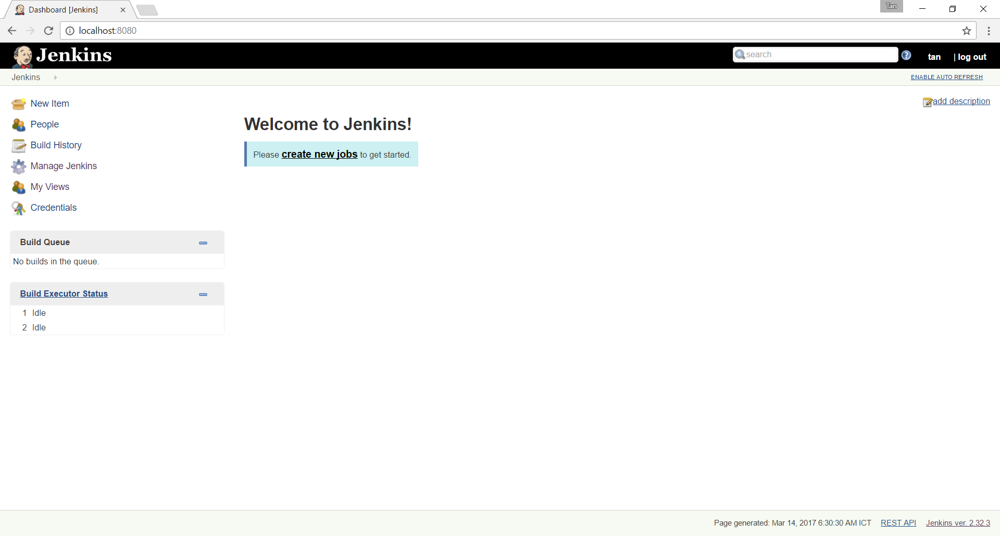

<h1 class="c32" id="h.5an0jsi6p0pm">Intro GOL Demo Project (a Java Maven Project)</h1>
In this book, project called GOL (game of life) is used to express the features related to Jenkins. So it will be helpful to review some information related to this project.
<h2 class="c43" id="h.wzp2icx0qjfi">Github Repository</h2>
GOL&nbsp;project is hosted on Github at <a class="c16" href="https://www.google.com/url?q=https://github.com/tanpv/gol&amp;sa=D&amp;ust=1491492107970000&amp;usg=AFQjCNHSsJs3cW2f_dXHv7i_-zEIzXdCRA">https://github.com/tanpv/gol</a>. Please fork&nbsp;to your Github account so you can try Jenkins features by yourself later.

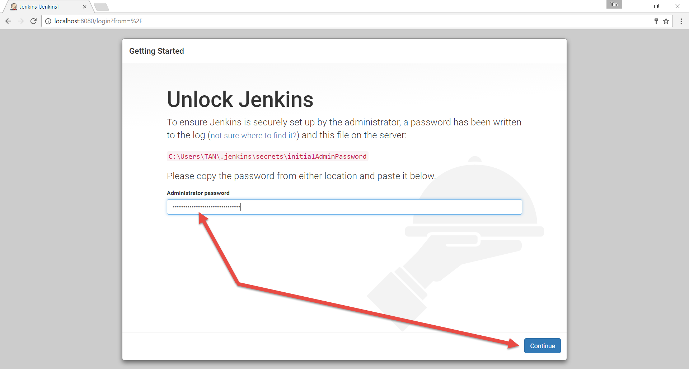&nbsp;

<h2 class="c43" id="h.9s2y2cstwyjr">Maven Pom File Structure</h2>
This section show you POM file from project GOL above

Download GOL project from Github to your local and unzip.

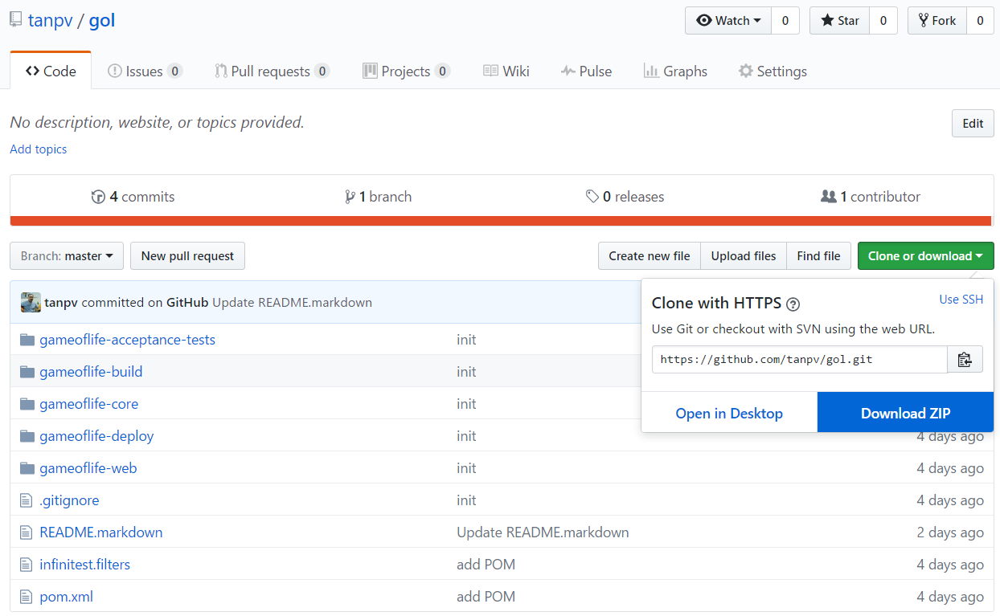

From eclipse open GOL project from unzipped directory. Open POM file you will see how project is structured.

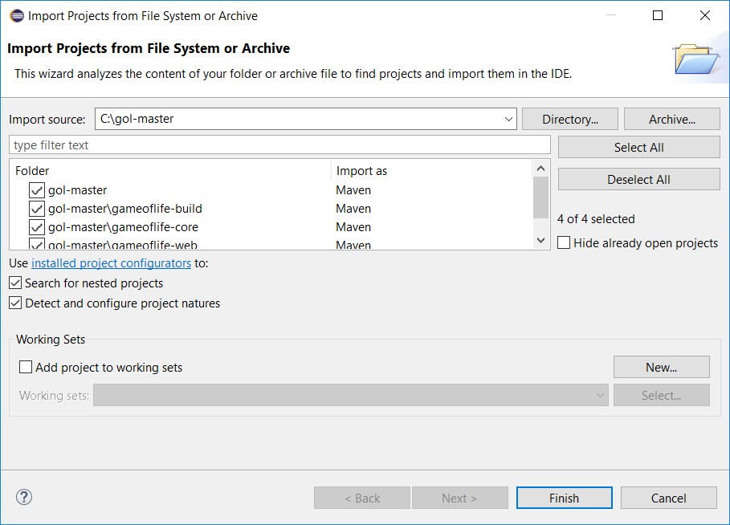

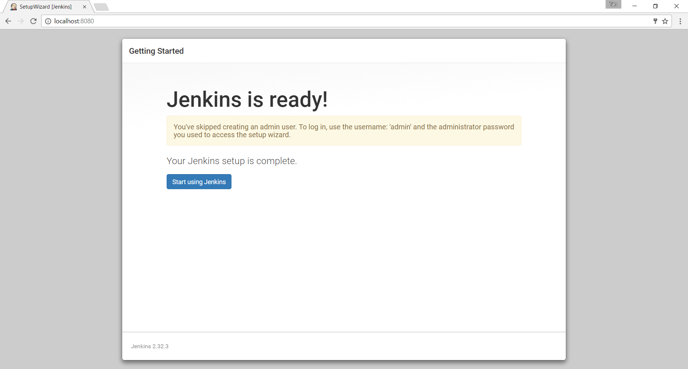

Install maven to your local and you can try to build this project manually by command

Wait a while you can see output of the build as web application war&nbsp;file inside folder C:\gol-master\gameoflife-web\target

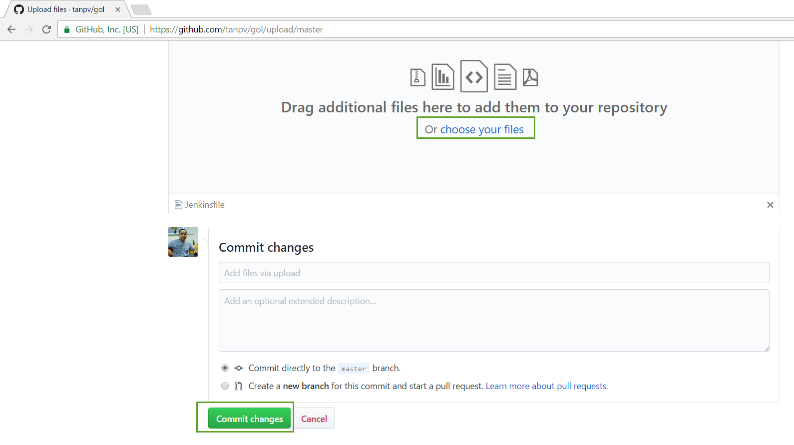

<h2 class="c43" id="h.1jvcyr5ke0rq">How GOL Look Like after Deploy to Application Server</h2>
Deploy this application to Tomcat server, and you will see some the app from browser and actually start a new game !.

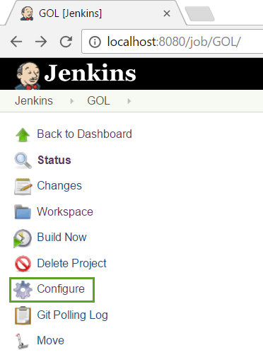

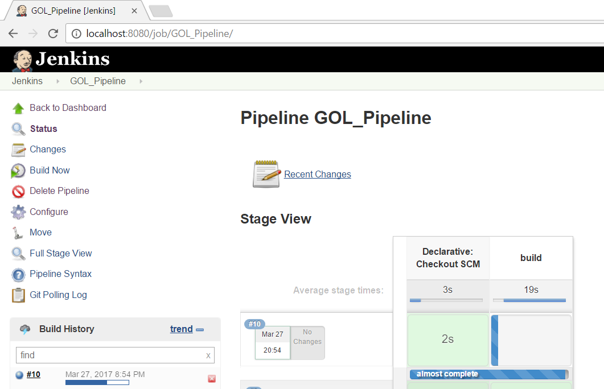
<h1 class="c49 c63" id="h.d8sr55rm7c0q"></h1><h1 class="c49" id="h.iy9gg72smteg">Continuous Integration with Jenkins</h1>
This chapter will show you how to automate software build with Jenkins.
<h2 class="c47" id="h.upxm9kk9li6g">Create GOL Job</h2>

From home page, click to New Item&nbsp;link

Enter GOL&nbsp;for project name and then chose Freestyle project&nbsp;and finally click to OK&nbsp;button to create a new job with name is GOL

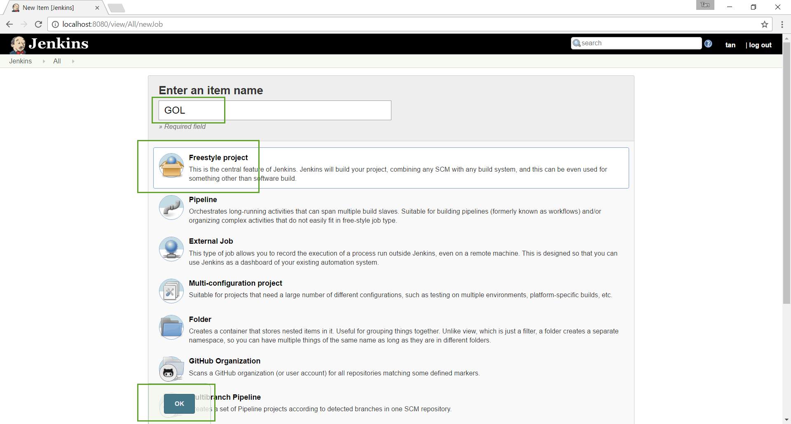

Then a new screen will show up allow us to configure everything for GOL&nbsp;job.

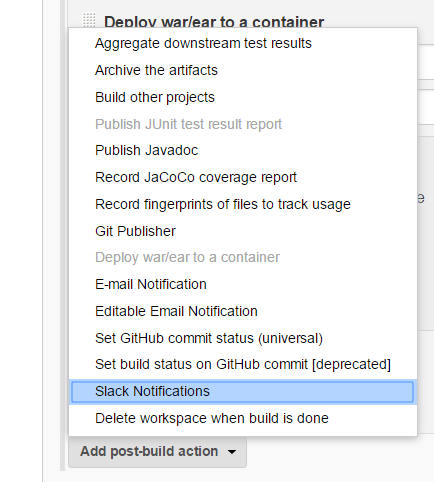

Description is place to describe what mission of this job and steps inside the job. Put follow text into Description session.

&ldquo; Following task will be done by GOL job :
<ul class="c8 lst-kix_puvgbbiydmbp-0 start"><li class="c4 c9 c6">Download source code from Github repository <a class="c16" href="https://www.google.com/url?q=https://github.com/tanpv/gol&amp;sa=D&amp;ust=1491492108016000&amp;usg=AFQjCNFbWbRKgotjCchEbF-jJzM3Jnyk2w">https://github.com/tanpv/gol</a></li><li class="c4 c9 c6">Build web application from java source </li><li class="c4 c9 c6">Run automation test with test script already specify inside project</li><li class="c4 c9 c6">Publish automation test result to Jenkins dashboard</li><li class="c4 c9 c6">Deploy web application to Tomcat server &rdquo;</li></ul>

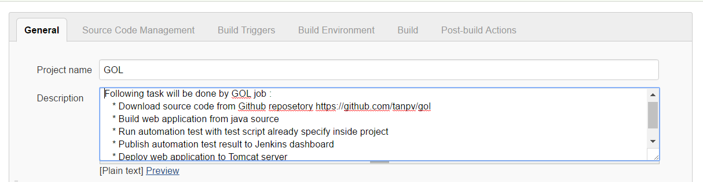

<h2 class="c43 c62" id="h.o1n93zxkpykk"></h2><h2 class="c43" id="h.51gxa5vnxykn">Source Code Management</h2>
Purpose of this part is answer for question Where to get source code ?&nbsp;for our software build. From job configure, click into Source Code Management&nbsp;tab

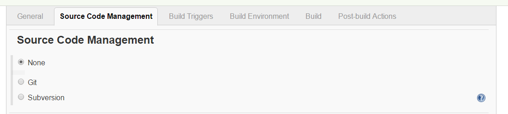

<h3 class="c27" id="h.2fvskibuhyn3">Check if git is installed in local machine</h3>

In order to clone source code from Github, local machine should install Git.

To check if local machine already install git or not, open command prompt and typing

git --help

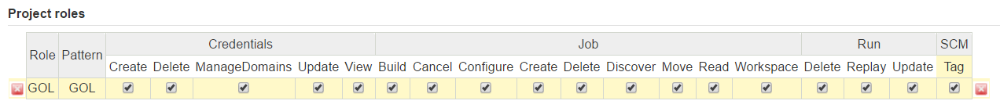

To download and install git, please refer to this link <a class="c16" href="https://www.google.com/url?q=https://git-scm.com/downloads&amp;sa=D&amp;ust=1491492108038000&amp;usg=AFQjCNF3OW0AgQ-bMVlxaZHYPRVAX_W0pw">https://git-scm.com/downloads</a>

<h3 class="c27" id="h.hs33iab4lu4t">Specify source code repository</h3>

Because we host project source code on Github, so you will choose Git&nbsp;as below.

To get repo link, go to Github <a class="c16" href="https://www.google.com/url?q=https://github.com/tanpv/gol&amp;sa=D&amp;ust=1491492108046000&amp;usg=AFQjCNEWo-lS5fQpgpul5eZjPZGevu0Dvw">https://github.com/tanpv/gol</a>&nbsp;then click to Clone or download&nbsp;button, you will see the repo link. Copy this link.

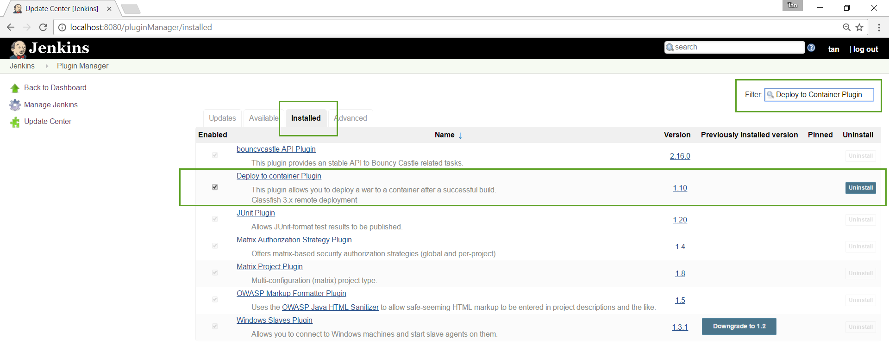

Put the repo link <a class="c16" href="https://www.google.com/url?q=https://github.com/tanpv/gol.git&amp;sa=D&amp;ust=1491492108052000&amp;usg=AFQjCNFj0jpzUe_kYojmUi_WB6smsCqJvw">https://github.com/tanpv/gol.git</a>&nbsp;in to Repository URL section. The branch will be default as */master

Click to Save button&nbsp;and that it, we already tell to Jenkins where to get source code.

<h3 class="c27" id="h.l6m22ps0eeyl">Check if setting working fine</h3>

This is the time to try for first running and see if source code from Github is clone or not.

Go back to home page then click to GOL job

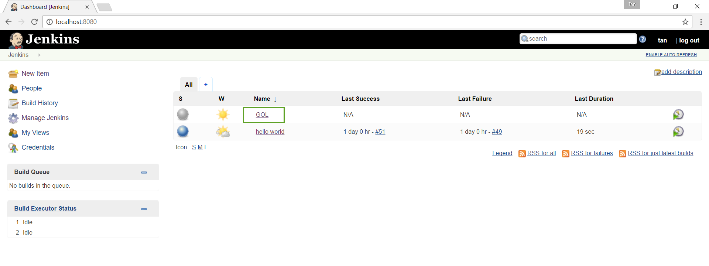

The dashboard for GOL will show up, you will see describe which we just added before

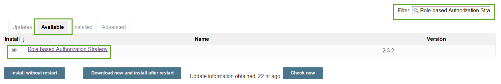

Click in to Build Now to activate job run immediately.

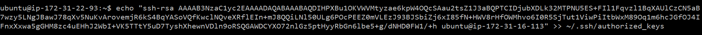

You will see GOL start running as expected

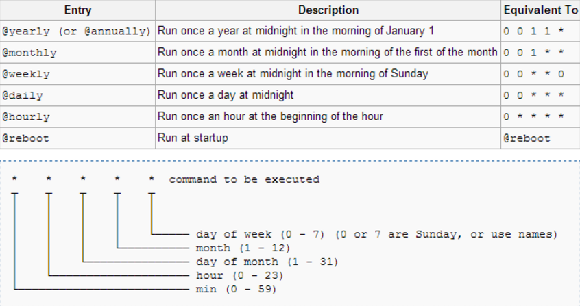

To see how job running, select Console Output from context menu while you click to build number


Then the job log will show up every thing happen in order to clone source code from Github repository. You can see that the build already success running.


Now we could go to local repository to see the source code already downloaded. Each job will have it&rsquo;s own folder inside workspace&nbsp;folder


That it, we complete the first step of this job.

<h2 class="c52" id="h.5ey6ujjqtiq0">Build Triggers</h2>


The first way and most simple way to start LOG job is just click in to Build Now&nbsp;button. But this way is manually and not so cool. We want to trigger Jenkins job running automatically, so to do this, click to Configure from LOG dashboard.


Then select to Build Triggers&nbsp;tab you will some option to configure so job could trigger automatically


Have 5 ways to automate trigger Jenkins job as show above. In this book I will focus on Poll SCM, the good way in configure for a continuous system. Now you click on Poll SCM, you will see a text box show up for setting schedule


So following are steps show up how Poll SCM work :
<ul class="c8 lst-kix_lkhgogguxtdp-0 start"><li class="c4 c9 c6">Base on schedule setting, Jenkins will actively check Github repository to see if have any change from repository</li><li class="c4 c9 c6">If have any change on Github repo Jenkins job will trigger</li></ul>


Schedule with Poll SCM&nbsp;work follow cron schedule rule, above image show some cron schedule example. Basically, we want to catch the change on Github repository as soon as possible, so follow text will be add to Schedule&nbsp;* * * * * . This mean we want to check change on Github every minute !


Click to Save and Jenkins will move you back to job dashboard


Now is the time to check if this setting really work ?

I will go to my GOL project repo on Github and change content of file README.markdown&nbsp;right from web browser (Github support commit change right from web browser)


Now come back to job dash board, wait for about 1 minute, you will see new job is planning and run.


That it, it work !!!, to practice by yourself, &nbsp;just clone GOL project to your account by Fork button and then change the GOL configuration point to your github account as show below.


<h2 class="c52" id="h.22ikuqy0seqi">Build</h2>
In this section, We will setting to build java web app with maven.
<h3 class="c27" id="h.w1ad2xfp4isa">Maven installation</h3>
First step, maven should be installed in machine witch running Jenkins job. To check this, just open command prompt and typing in mvn --help , you will some all available maven command.

In case maven not yet install follow these steps to do maven installation (for Window)

<ul class="c8 lst-kix_m83r3x2es101-0 start"><li class="c4 c9 c6">Download maven from link <a class="c16" href="https://www.google.com/url?q=http://maven.apache.org/download.cgi&amp;sa=D&amp;ust=1491492108140000&amp;usg=AFQjCNFF8zQFT5TphIFcbe362O4oV2CV3g">http://maven.apache.org/download.cgi</a></li></ul>

<ul class="c8 lst-kix_ya3pkq3s8an1-0 start"><li class="c4 c9 c6">Unzip zip file to one folder (for example I unzip to C:\apache-maven-3.3.9)</li></ul>

<ul class="c8 lst-kix_y3povfq1olkt-0 start"><li class="c9 c6 c48">Add M2_HOME and MAVEN_HOME variable point to above foder</li></ul>

<ul class="c8 lst-kix_hh8gk1a1lt3k-0 start"><li class="c4 c9 c6">Add mavin bin to Path variable so you can call maven from any place</li></ul>


That it, to check maven installed successfully, open cmd and typing in mvn --help

Help content for mvn should show up correctly

<h3 class="c27" id="h.c4mujaylvh6a">Try to run maven build manually</h3>

Now maven is ready, we can try to run the build for source code which we just clone from Github repository at source code management&nbsp;step.

Open cmd and change directory to repository GOL folder. And then typing in mvn install

This command will run java source unit test and then build this web application to a .war file


You will build result from command prompt


And can see actual .war file inside target folder of gameoflife-web. This folder could be use to deploy with web application server.


<h3 class="c27" id="h.qaqlgqakhyub">Configure Build Step</h3>
From GOL job dashboard, click to Configure link, the configure page will show up


From configure page, select Build tab, page will scroll down to Add build step

&nbsp;

Click to Add build step and select Invoke top-level Maven targets

Section to adding maven command will show up as below

Put Goals maven command clean install

Then finally click in to Save button. That it we already complete configure for build maven step.

<h3 class="c27" id="h.ad9nx4qxzuh7">Check Log and Workspace</h3>
Now from dashboard of GOL, just click to Build Now to see how Jenkins job work by open console log


Scroll this log to bottom you will see build job run successfully

From GOL home page, click to Workspace


You will access directory where build happen and actually could see the war file inside Gameoflife-web/target/. You could actually download war file from here.

That it, We already finish setting up build step.
<h1 class="c32" id="h.ibq1865hb893">Continuous Inspection with Jenkins</h1><h2 class="c52" id="h.an52ieq52j86">Job Configure for Test Report</h2>

From job dashboard, click to Configure. Because showing unit test result on dashboard is done after job build successfully, so we&nbsp;click to tab Post-build Actions.


Click to Add post-build action, from dropout menu, select Publish JUnit test result report


Input path to maven test result **/target/surefire-reports/*.xml

Click Save&nbsp;button to finish configure

<h2 class="c28" id="h.qq75ugi9gsc1">Test Report on Job Dashboard</h2>

From job dashboard, click to Build Now. After job run successfully, you will see a link lead to test result. Click to Latest Test Result


The test report show up, from here you can see many statistic related to test.


Continue run second &nbsp;time, you will see a chart on job dash board which show up how trending in test result or changing from build to build.


<h1 class="c32" id="h.h4wtunn3nnwl">Continuous Delivery&nbsp;with Jenkins</h1>
This session will show you how to deploy web application (.war file) to a Tomcat web server.
<h2 class="c52" id="h.jbswqov5xizr">Install Tomcat Server as Service</h2>
To install Tomcat 7 server, you just following these steps:
<ul class="c8 lst-kix_d8fnjjs7ewzm-0 start"><li class="c4 c9 c6">Download Tomcat 7 from this page <a class="c16" href="https://www.google.com/url?q=http://tomcat.apache.org/download-70.cgi&amp;sa=D&amp;ust=1491492108233000&amp;usg=AFQjCNEuzdmZbz6ViF2oWn4d15BeHxrM2A">http://tomcat.apache.org/download-70.cgi</a>&nbsp;, note that we will download version <a class="c16" href="https://www.google.com/url?q=http://www-eu.apache.org/dist/tomcat/tomcat-7/v7.0.76/bin/apache-tomcat-7.0.76.exe&amp;sa=D&amp;ust=1491492108234000&amp;usg=AFQjCNFUCCL5qb0lvod20lwfjTk9-AxtTg">Windows Service Installer</a>&nbsp;so Tomcat will be installed as window service</li></ul>

<ul class="c8 lst-kix_bly2a2a5b93j-0 start"><li class="c4 c9 c6">Run installer and select port 8888 for running Tomcat (We already use 8080 for Jenkins installation)</li></ul>


<ul class="c8 lst-kix_kapk7a5eh89i-0 start"><li class="c4 c9 c6">After install successfully, a Tomcat service will running and you can access Tomcat server from localhost</li></ul>


<ul class="c8 lst-kix_rulan2rjvef3-0 start"><li class="c4 c9 c6">To control Tomcat from Jenkins, one user with role &ldquo;manager-script&rdquo; should be added to file conf\tomcat-users.xml . Then restart Tomcat server by service.</li></ul>


To check if admin user working, access to <a class="c16" href="https://www.google.com/url?q=http://localhost:8888/manager/text/list&amp;sa=D&amp;ust=1491492108250000&amp;usg=AFQjCNGR8thvMYdOirCcX5auCNZAGNnVlA">http://localhost:8888/manager/text/list</a>&nbsp;and then put on user / password you just specify


<h2 class="c52" id="h.y0d2en4gymp0">Install &ldquo;Deploy to Container Plugin&rdquo;</h2>
In order to deploy war file in Tomcat server, we need to install &ldquo;Deploy to Container Plugin&rdquo;.

From Jenkins home page, click to Manage Jenkins


Then click to Manage Plugin


Click to tab Available, typing &ldquo;Deploy to Container Plugin&rdquo;, then click to Install without restart&nbsp;button


After install you will see it show up inside Installed tab


<h2 class="c28" id="h.l2b3bds58ork">Add Deploy Step</h2>
Open GOL job configuration, click to &ldquo;Post-build Actions&rdquo;&nbsp;tab, click to &ldquo;Add post-build action&rdquo;, and select item &ldquo;Deploy war/ear to a container&rdquo; from context menu


Select &ldquo;Tomcat 7.x&rdquo; from Containers

Input path to war file, input context path, and finally input admin user/password&nbsp;which already created at step install Tomcat server.


Finally click to Save button.
<h2 class="c28" id="h.dv7s5lft0k36">Check if Deploy Step Run Successfully</h2>
From GOL job dashboard, click into Build Now, wait some time until job complete and you will see consolog for step deploy GOL to Tomcat server


And now you try to access GOL web app at <a class="c16" href="https://www.google.com/url?q=http://localhost:8888/gol/&amp;sa=D&amp;ust=1491492108290000&amp;usg=AFQjCNF2udDTMZ8zF60XAdj8x8rpLIu9-w">http://localhost:8888/gol/</a>


That it, deployment step working fine now. And the great thing is you know you are testing on what build on Jenkins.

<h1 class="c32" id="h.wvt3qwwjai02">Continuous Monitoring with Jenkins</h1><h2 class="c28" id="h.q1nswudt489k">Create Slack Team and Install Jenkins CI App</h2>
From Slack, create a new team call jenkins-demo


Create a new channel call&nbsp;#build, this channel will be used to notify message from Jenkins


From jenkins-demo&nbsp;home page, click to Add an app or integration


Search for Jenkins CI&nbsp;application


Click to Install&nbsp;button


Select #build&nbsp;and click Add Jenkins CI integration

Copy information related to team domain and token, this information will be use to configure Jenkins job later

<h2 class="c28" id="h.qeamhq3pzti5">Install Slack Notification Plugin to Jenkins</h2>
Go to Plugin Manager and install Slack Notification plugin


Go to Manage Jenkins, click to Configure System


Search for section Global Slack Notifier Settings, and put in information for Team Subdomain and Integration Token (This infor get from previous step ), then click to Test Connection, you will see connection successfully. Finally click to Save button.


That it, now Slack notification is ready used inside Jenkins job.
<h2 class="c28" id="h.o966bnjqympg">Configure GOL Using Slack Notification</h2>
From Jenkins home page, click to Configure of GOL job


From Configure page, click to tab Post-build Actions, then add a Slack Notifications step.


Select when the notify will be send


Click to Advanced and put information for Team Subdomain and Integration Token. Finally click to Save&nbsp;button.

<h2 class="c25" id="h.plbbewpi6a7j"></h2><h2 class="c28" id="h.pac8aq9og0rv">Check if Notification Work</h2>
From GOL home page click to Build Now

And notification message will be send to #build&nbsp;channel as expected


That it, from now on, GOL build and deploy job will be automatically watched by Slack Notification.

<h1 class="c32" id="h.9nd9xxh92qz6">Distributed Build System with Jenkins</h1><h2 class="c28" id="h.dltdsbc8vnzz">Jenkins Architecture</h2>


Normally, job will do not run on machine which install Jenkins but running on slave machines and these slaves machine are controlled by master machine where Jenkins is installed.
<h2 class="c28" id="h.6dv54ua2zozk">Windows Slave Agent</h2><h3 class="c27" id="h.gux6ly60yci8">Enable &nbsp;Launch Slave Agents via Java Web Start</h3>

From Jenkins home page, click to Manage Jenkins


Then click to Configure Global Security


Select Random&nbsp;for option TCP port for JNLP agents


Then finally click Save&nbsp;button

<h3 class="c27" id="h.aqj2gns6thm6">Add New Windows Slave</h3>

From Jenkins home page, click to Manage Jenkins

On Manage Jenkins&nbsp;page, scroll down and click to Manage Nodes


From there you can see all computer currently exist in system. We just have one master machine. To create new node, click to New Node


Input agent name and click to OK button


Input Remote root directory, select Launch agent via Java Web Start, Finally click to Save button

<h3 class="c27" id="h.k3eoocsovbik">Launch Slave Agent</h3>
From computer which we want to install as slave ( for demo, I use same machine for both master and slave) access to link <a class="c16" href="https://www.google.com/url?q=http://localhost:8080/computer/&amp;sa=D&amp;ust=1491492108390000&amp;usg=AFQjCNHw29l1Y-BeqZNDhOVRkTPi8_HKpw">http://localhost:8080/computer/</a>

You could see that currently Window_Agent is disconnected with Jenkins.


Click to Windows_Agent and then click to Launch button


File slave-agent.jnlp will be downloaded to local, copy this file to C:\jenkins_slave


Start a command prompt as administrator.


Change directory to C:\jenkins_slave&nbsp;then execute command javaws slave-agent.jnlp


A dialog will show up, click to Run button


A dialog will show up and message that connected successfully


Go back to link <a class="c16" href="https://www.google.com/url?q=http://localhost:8080/computer/&amp;sa=D&amp;ust=1491492108415000&amp;usg=AFQjCNF08tAWmNd34wltx5-XiczYlyyJAA">http://localhost:8080/computer/</a>&nbsp;&nbsp;and refresh, you will see Window_Agent up and running successfully.


Now Window_Agent ready for use. But we will do one more step to setting up slave agent as a Windows service. From Jenkins slave agent dialog, click to File and then select Install as a service


Then click OK for question


Current dialog will close up and new service for slave agent is installed successfully.

From now on, everytime machine power up, this machine will automatically connect to jenkins master and ready for running job.

<h3 class="c27" id="h.vyzzycnxwix0">Running Job with Windows Slave Agent</h3>

From GOL job dashboard, click to Configure

From General&nbsp;tab, click to Restrict where this project can be run, then enter &ldquo;Windows_Agent&rdquo; in Label Expression. This mean we only want GOL job running on machine represented by &ldquo;Windows_Agent&rdquo; . Then finally click to Save button.


Now try to run GOL from it&rsquo;s dashboard by click on Build Now

From Jenkins home page, you could see GOL running with Windows_Agent machine


<h2 class="c28" id="h.j2isbwu25bnq">Ubuntu Slave Agent</h2><h3 class="c27" id="h.kbsm7r1z9mae">Enable &nbsp;Launch Slave Agents via Java Web Start</h3><h3 class="c27" id="h.tc4f50cdmgts">Add New Ubuntu Slave Agent</h3>
From jenkins home page, click to Manage Jenkins, then click to Manage Nodes


From Nodes screen, click to New Node


<h3 class="c27 c67" id="h.hkcv4ce5gy6g"></h3>
Put the name &ldquo;Ubuntu_Agent&rdquo;, click to Save&nbsp;button


Specify Remote root directory, then click Save&nbsp;button


<h3 class="c27" id="h.c05iotguhszp">Launch Slave Agent</h3>

Go to Ubuntu machine which you want it become a jenkins agent and click to Ubuntu_Agent


Click to Launch&nbsp;button


Click to OK&nbsp;button


One dialog will show up that agent and master already connect


Now you will see Ubuntu_Agent&nbsp;up and running from Jenkins home page. And you could create job which need to running on Ubuntu machine.


<h1 class="c32" id="h.fvsxn7lv8o1i">Jenkins Pipeline</h1><h2 class="c28" id="h.dlab1wfwtguq">What is Jenkins Pipeline ?</h2>
Jenkins Pipeline is a suite of plugins which supports implementing and integrating continuous delivery pipelines into Jenkins. Pipeline provides an extensible set of tools for modeling simple-to-complex delivery pipelines &quot;as code&quot; via the <a class="c16" href="https://www.google.com/url?q=https://jenkins.io/doc/book/pipeline/syntax/&amp;sa=D&amp;ust=1491492108489000&amp;usg=AFQjCNF--sFdv2RNj7855f2JLAo16UKM9A">Pipeline DSL</a>.

Following are common steps to use pipeline:
<ul class="c8 lst-kix_rw5wy3uhj99l-0 start"><li class="c4 c9 c6">Create a Jenkinsfile&nbsp;which describe what kind of command with run while pipeline running.</li><li class="c4 c9 c6">Add this Jenkinsfile to the root of project on Github repository. Jenkinsfile use Groovy grammar.</li><li class="c4 c9 c6">Create a new job with type Pileline</li><li class="c4 c9 c6">Run pipeline job</li></ul>

<h2 class="c28" id="h.xndci758kyb7">Create a Jenkinsfile</h2>
From your local machine, create a new file with name Jenkinsfile


Put following code into Jenkinsfile, this code basically will run maven command to build web application.

<table class="c38"><tbody><tr class="c24"><td class="c15" colspan="1" rowspan="1">
// start of pipeline

pipeline {

&nbsp; // where pipeline job will run  &nbsp;agent any

&nbsp; // start of stages : build, test, deploy ...  &nbsp;stages {

&nbsp; &nbsp; // start of stage : build  &nbsp; &nbsp;stage(&#39;build&#39;) {

&nbsp; &nbsp; &nbsp; // start of running steps inside one stage  &nbsp; &nbsp; &nbsp;steps {

&nbsp; &nbsp; &nbsp; &nbsp; // invoke command to build with maven  &nbsp; &nbsp; &nbsp; &nbsp;bat &#39;mvn clean install&#39;  &nbsp; &nbsp; &nbsp;}  &nbsp; &nbsp;}  &nbsp;}  }
</td></tr></tbody></table>

Access to GOL github repo from browser, click to Upload files, &nbsp;then drag drop Jenkinsfile which already created. Finally click to Commit changes


Wait some time and you will see the file show up inside GOL repository


<h2 class="c28" id="h.quzommg9qo92">Create Pipeline Job</h2>
From Jenkins home page click to New Item


Typing job name GOL_Pileline, select Pipeline job style, and click to Save button


From job dashboard GOL_Pipeline, click to Configure

Select Build Triggers tab, select Post SCM check box, then put in following string to check change every minute on github &ldquo;* * * * *&rdquo;


Select Pipeline tab, then select Pipeline script from SCM


From SCM&nbsp;dropbox, select Git, then put in GOL project repository url <a class="c16" href="https://www.google.com/url?q=https://github.com/tanpv/gol.git&amp;sa=D&amp;ust=1491492108548000&amp;usg=AFQjCNHADEvQM_8OzjCB5-ihanVNYa0H4g">https://github.com/tanpv/gol.git</a>&nbsp;, finally click to Save button.

That it, we already complete create the first pipeline job with Jenkins!

<h2 class="c28" id="h.y9v78xmy5d3y">Build with Pipeline</h2>
From GOL dashboard, click to Build Now


You will see job run with quite nice progress show up


Click to Console Log, build log will show up with build success for GOL project.


<h2 class="c28" id="h.54d1l9aolsho"></h2><h2 class="c28" id="h.jiehqyh2wg6z">Running Pipeline On Specific Agent</h2>
Edit Jenkinsfile on Github with following content, basically this code will force pipeline to only running on Windows_Agent

<table class="c38"><tbody><tr class="c24"><td class="c15" colspan="1" rowspan="1">
// start of pipeline pipeline {  &nbsp;// where pipeline job will run  &nbsp;agent {  &nbsp; &nbsp;// force pipeline job to running on windows_agent  &nbsp; &nbsp;label &quot;Windows_Agent&quot;  &nbsp;}  &nbsp;// start of stages : build, test, deploy ...  &nbsp;stages {  &nbsp; &nbsp;// start of stage : build  &nbsp; &nbsp;stage(&#39;build&#39;) {  &nbsp; &nbsp; &nbsp;// start of running steps inside one stage  &nbsp; &nbsp; &nbsp;steps {  &nbsp; &nbsp; &nbsp; &nbsp;// invoke command to build with maven  &nbsp; &nbsp; &nbsp; &nbsp;bat &#39;mvn clean install&#39;  &nbsp; &nbsp; &nbsp;}  &nbsp; &nbsp;}  &nbsp;}  }
</td></tr></tbody></table>

Click to Commit changes


You will see GOL_Pipeline automatically run due to it saw code change from Github


And from Console Output, you can see that GOL_Pipeline job is running with &ldquo;Windows_Agent&rdquo;


<h2 class="c28" id="h.zhw8jm7j338">Deploy to Tomcat with Pipeline</h2>
Edit Jenkinsfile on GOL repository with following code, this code add deployment to Tomcat server step.
<table class="c38"><tbody><tr class="c24"><td class="c15" colspan="1" rowspan="1">
// start of pipeline pipeline {

  &nbsp;// where pipeline job will run  &nbsp;agent {  &nbsp; &nbsp;// force pipeline job to running on windows_agent  &nbsp; &nbsp;label &quot;Windows_Agent&quot;  &nbsp;}

  &nbsp;// start of stages : build, test, deploy ...  &nbsp;stages {

  &nbsp; &nbsp;// start of build stage  &nbsp; &nbsp;stage(&#39;build&#39;) {  &nbsp; &nbsp; &nbsp;// define step to run  &nbsp; &nbsp; &nbsp;steps {  &nbsp; &nbsp; &nbsp; &nbsp;// invoke command to build with maven  &nbsp; &nbsp; &nbsp; &nbsp;bat &#39;mvn clean install&#39;  &nbsp; &nbsp; &nbsp;}  &nbsp; &nbsp;}

  &nbsp; &nbsp;// start of deploy state  &nbsp; &nbsp;stage(&#39;deploy&#39;) {  &nbsp; &nbsp; &nbsp;// define step to run  &nbsp; &nbsp; &nbsp;steps {  &nbsp; &nbsp; &nbsp; &nbsp;//invoke command to stop tomcat service  &nbsp; &nbsp; &nbsp; &nbsp;bat &#39;sc stop Tomcat7&#39;  &nbsp; &nbsp; &nbsp; &nbsp;bat &#39;ping 127.0.0.1 -n 6&#39;  &nbsp; &nbsp; &nbsp; &nbsp;// copy war file from build target to webapp Tomcat folder  &nbsp; &nbsp; &nbsp; &nbsp;bat &#39;xcopy /y C:\\jenkins_slave\\workspace\\GOL_Pipeline\\gameoflife-web\\target\\gameoflife.war &quot;C:\\Program Files\\Apache Software Foundation\\Tomcat 7.0\\webapps&quot;&#39;  &nbsp; &nbsp; &nbsp; &nbsp;//invoke command to start tomcat service &nbsp; &nbsp; &nbsp;  &nbsp; &nbsp; &nbsp; &nbsp;bat &#39;sc start Tomcat7&#39;  &nbsp; &nbsp; &nbsp;}  &nbsp; &nbsp;}  &nbsp;}  }
</td></tr></tbody></table>

&nbsp;

Commit change of Jenkinsfile to Github right from browser


Wait for about 1 minute and GOL_Pipeline job will automatically build

From Console Output will see deploy to Tomcat7 step

Check the site and you will see it work fine at <a class="c16" href="https://www.google.com/url?q=http://localhost:8888/gol&amp;sa=D&amp;ust=1491492108620000&amp;usg=AFQjCNFXLr-YxOR-Ax6YdEyPSPczYMBq5Q">http://localhost:8888/gol</a>

<h1 class="c32" id="h.yp3dxge0eqju">Jenkins Security</h1><h2 class="c28" id="h.j7h7946ga4i">Create gol_developer user</h2>
From Manage Jenkins, click to Manage Users


Click to Create User


Add information for new user

Then new user is created

<h2 class="c28" id="h.rckgyp92zjw9">Matrix-based Security</h2>
Click Configure Global Security

Click to Matrix-based security

Setting all permission for your user, and try to setting for user gol_developer&nbsp;overall read and job read permission. Finally click to Save button.


Logout from your account, then try to login with gol_developer&nbsp;user. Now GOL_developer could read the jobs only.


<h2 class="c28" id="h.jcfrawu4kgnb">Role-based Security</h2><h3 class="c27" id="h.mbkjcd1vq7l9">Install Role-based Plugin</h3>

From home page click to Manage Jenkins, then Manage Plugin. 

At Manage Plugin page, select tab Available, then typing into filter Role-based Authorization Strategy, click to Install without restart 


<h3 class="c27" id="h.2hu4luhd14ac">Configure Global Role</h3>

From Manage Jenkins, configure to Configure Global Security, and then at session Authorization select Role-based Strategy&nbsp;option. Then click to Save button.

&nbsp;

Now from Manage Jenkins, you will see new item call Manage and Assign Roles

Click to Manage and Assign Roles, UI allow to Manage Roles and Assign Roles&nbsp;will show up


Click to Manage Roles, at Global roles, add dev role with read permission at Overall&nbsp;and full permission with Job, then click to Save


Back to screen &nbsp;Manage Roles and Assign Roles, then click to Assign Roles. Now assign GOL_Developer to dev role. Click to Save


That it, now try to logout from Jenkins and login with user GOL_developer. You will see GOL_developer could see all the job, but could not see Manage Jenkins


<h3 class="c27" id="h.pjpimucrtpt8">Configure Project Role</h3>
Currently, GOL_developer could see and access all jobs, You want to configure so GOL_developer only could see GOL project.

From Manage and Assign Roles screen, click to Manage Roles, at Project roles section, add GOL


And then select all permission for GOL role. Click Save button.


From Global roles section, remove all permission related to job and only keep overall read permission.

Now come back to Assign Role screen, then at the Project Role section, add GOL_developer user, and select GOL role for this user. Save configure.


Logout from your admin and login back with GOL_developer. Now you can see that GOL_developer only see GOL project.

&nbsp;


<h2 class="c28" id="h.1oa7n0tz7mvt">Disable Security</h2>
In some case, you do not need any security (like a personal build system), you just want to disable Jenkins security. To do this, go to place where Jenkins is installed, edit file config.xml

Change value of attribute useSecurity to false

Restart Jenkins by service after change security configure


Now, You can do anything by just access to Jenkins without of need to login

And You can see a warning message from Jenkins show that security is disabled. And suggest You go for configure security


<h2 class="c25" id="h.6qdsy4y0yho0"></h2>

<a class="c16" href="https://www.google.com/url?q=https://www.youtube.com/watch?v%3DrdypdeG_idE&amp;sa=D&amp;ust=1491492108733000&amp;usg=AFQjCNE18m3j9ZPSkiMr6FwrIyYSiThDsw">https://www.youtube.com/watch?v=rdypdeG_idE</a>

<h1 class="c32" id="h.q6pveym1l6yj">Jenkins Backup and Restore</h1><h2 class="c28" id="h.pdhk7oa3zpri">Install and Configure ThinBackup Plugin</h2>
From Plugin Manager, select Available tab, search for thinBackup plugin, select check box, then click to Install without restart


From Manage Jenkins, click to ThinBackup, then click to Settings


Normally we not need to backup build result, so uncheck Backup build results. Specify 0 0 * * 0&nbsp;mean do full backup every 7 days (This is for demo, you can specify timeline that suite with your jenkins system). Finally, click to Save button


<h2 class="c28" id="h.qu5indkojsl4">Manually Backup</h2>

Now click to Backup Now you will see full backup folder is created inside C:\jenkins_bk


<h2 class="c28" id="h.i7rnz89t1f9g">Restore from Backup</h2>
Try restore function by delete a job and then restore it. From home page click to GOL job, then click to Delete Project


From ThinBackup click to Restore


Select version want to restore and click to Restore button


Restart Jenkins by window service


Now back to Jenkins home page, You will see GOL job restored successfully.


<h1 class="c52" id="h.gn0x268r1i44">Jenkins Interview Questions</h1><h2 class="c52" id="h.rxyfei3zczhq">Jenkins Interview Question</h2><h3 class="c27" id="h.y2op7uk97x84">What is Jenkins?</h3>
Jenkins is an open source tool with plugin built for continuous integration purpose. &nbsp;The principle functionality of Jenkins is to keep a track of version control system and to initiate and monitor a build system if changes occur. It monitors the whole process and provides reports and notifications to alert.

<h3 class="c27" id="h.xm3vmbdn1rif">What is the requirement for using Jenkins?</h3>
To use Jenkins you require
<ul class="c8 lst-kix_1n0ysqic0bq6-0 start"><li class="c4 c9 c6">A source code repository which is accessible, for instance, a Git repository</li><li class="c4 c9 c6">A working build script, e.g., a Maven script, checked into the repository</li></ul>

<h3 class="c27" id="h.fj3wh931blxs">What are the advantages of Jenkins?</h3>
Advantage of Jenkins include
<ul class="c8 lst-kix_y595gas2s3xj-0 start"><li class="c4 c9 c6">At integration stage, build failures are cached</li><li class="c4 c9 c6">For each code commit changes an automatic build report notification generates</li><li class="c4 c9 c6">To notify developers about build report success or failure, it is integrated with LDAP mail server</li><li class="c4 c9 c6">Achieves continuous integration agile development and test driven development</li><li class="c4 c9 c6">With simple steps, maven release project is automated</li><li class="c4 c9 c6">Easy tracking of bugs at early stage in development environment than production</li></ul>

<h3 class="c27" id="h.yb889sc6opfj">How you can move or copy Jenkins from one server to another?</h3><ul class="c8 lst-kix_kwduqdxaa0i3-0 start"><li class="c4 c9 c6">Slide a job from one installation of Jenkins to another by copying the related job directory</li><li class="c4 c9 c6">Make a copy of an already existing job by making clone of a job directory by a different name</li><li class="c4 c9 c6">Renaming an existing job by renaming a directory.</li></ul>

<h3 class="c27" id="h.u6dfeyc3rzxr">What are the commands you can use to start Jenkins manually?</h3>
To start Jenkins manually, you can use either of the following
<ul class="c8 lst-kix_g516qnbz7dhp-0 start"><li class="c4 c9 c6">(Jenkins_url)/restart: Forces a restart without waiting for builds to complete</li><li class="c4 c9 c6">(Jenkin_url)/safeRestart: Allows all running builds to complete</li></ul>

<h3 class="c27" id="h.jbd5lu653hpo">How can create a backup and copy files in Jenkins?</h3>
Jenkins saves all the setting, build artifacts and logs in its home directory, to create a backup of your Jenkins setup, just copy this directory. You can also copy a job directory to clone or replicate a job or rename the directory.

<h3 class="c27" id="h.fqcc5fhwb8fj">How you can set up Jenkins job?</h3>
To create a project that is handled via jobs in Jenkins. &nbsp;Select New item from the menu, once this done enter a name for the job and select free-style job. Then click OK to create new job in Jenkins. &nbsp;The next page enables you to configure your job.

<h3 class="c27" id="h.yjckvfaxrfw">What are the two components Jenkins is mainly integrated with?</h3>
Jenkin is mainly integrated with two components
<ul class="c8 lst-kix_eelf1z8sk6fb-0 start"><li class="c4 c9 c6">Version Control system like GIT, SVN</li><li class="c4 c9 c6">And build tools like Apache Maven.</li></ul>

<h2 class="c28" id="h.t0p0lw4jy909">CI/CD Interview Question</h2>

<h3 class="c27" id="h.evhryk8qqzd">What is continuous integration?</h3>

It is a development practice that requires developers to integrate code into a shared repository several times a day. Each check-in is then verified by an automated build, allowing teams to detect problems early.


In the diagram shown above:

<ol class="c8 lst-kix_jqxbcu2oq4mv-0 start" start="1"><li class="c4 c9 c6">Developers check out code into their private workspaces.</li><li class="c4 c9 c6">When they are done with it they commit the changes to the shared repository (Version Control Repository).</li><li class="c4 c9 c6">The CI server monitors the repository and checks out changes when they occur.</li><li class="c4 c9 c6">The CI server then pulls these changes and builds the system and also runs unit and integration tests.</li><li class="c4 c9 c6">The CI server will now inform the team of the successful build.</li><li class="c4 c9 c6">If the build or tests fails, the CI server will alert the team.</li><li class="c4 c9 c6">The team will try to fix the issue at the earliest opportunity.</li><li class="c4 c9 c6">This process keeps on repeating.</li></ol>

<h3 class="c27" id="h.lzra1pc2fv1s">Why is Continuous Integration important?</h3>
Two important reasons:
<ul class="c8 lst-kix_gqgz7a93mqre-0 start"><li class="c4 c9 c6">Defects found early cost less to fix : When a defect is found immediately after a developer codes it, it takes 10x times less time to fix it compared to finding the defect a month later.</li><li class="c4 c9 c6">Reduced Time to Market : Software is always tested. So, it is always ready to move to further environments.</li></ul>

<h3 class="c27" id="h.r35jvjj9u53x">What are the success factors for Continuous Integration?</h3>

Here you have to mention the requirements for Continuous Integration. You could include the following points in your answer:
<ul class="c8 lst-kix_j09nc1ldglya-0 start"><li class="c4 c9 c6">Maintain a code repository</li><li class="c4 c9 c6">Automate the build</li><li class="c4 c9 c6">Make the build self-testing</li><li class="c4 c9 c6">Everyone commits to the baseline every day</li><li class="c4 c6 c9">Every commit (to baseline) should be built</li><li class="c4 c9 c6">Keep the build fast</li><li class="c4 c9 c6">Test in a clone of the production environment</li><li class="c4 c9 c6">Make it easy to get the latest deliverables</li><li class="c4 c9 c6">Everyone can see the results of the latest build</li><li class="c4 c9 c6">Automate deployment</li></ul><h1 class="c32" id="h.cjhsvny4h8le">Special Bonus</h1>
List of BEST DEVELOPMENT COURSE on Udemy with cheapest coupon from author! <a class="c16" href="https://www.google.com/url?q=http://devcourses.co&amp;sa=D&amp;ust=1491492108842000&amp;usg=AFQjCNFSAtEsZJNIlzpXRayjlaMiE2z--A">http://devcourses.co</a>

<ul class="c8 lst-kix_w4caul3qlrs9-0 start"><li class="c4 c9 c6">Web development bootcamp</li><li class="c4 c9 c6">Game development with C# and Unity</li><li class="c4 c9 c6">Game, app development for iOS</li><li class="c4 c9 c6">Game, app development for Android</li><li class="c4 c9 c6">Data science with Python</li><li class="c4 c9 c6">SQL and database</li></ul>

<h1 class="c32" id="h.s5qim6viyjan">More Reference</h1>

<table class="c38"><tbody><tr class="c24"><td class="c51 c58" colspan="1" rowspan="1">
Item
</td><td class="c51 c58" colspan="1" rowspan="1">
Links
</td></tr><tr class="c24"><td class="c51" colspan="1" rowspan="1">
Python Project and Jenkins
</td><td class="c51" colspan="1" rowspan="1">
<a class="c16" href="https://www.google.com/url?q=http://morschi.com/2015/07/22/setup-jenkins-to-build-python-projects-with-tests/&amp;sa=D&amp;ust=1491492108857000&amp;usg=AFQjCNGliE2CnePtqIhANYhTkNaV57JRVA">http://morschi.com/2015/07/22/setup-jenkins-to-build-python-projects-with-tests/</a>

</td></tr><tr class="c24"><td class="c51" colspan="1" rowspan="1">
.Net Project and Jenkins
</td><td class="c51" colspan="1" rowspan="1">
<a class="c16" href="https://www.google.com/url?q=https://blog.couchbase.com/continuous-deployment-with-jenkins-and-net/&amp;sa=D&amp;ust=1491492108861000&amp;usg=AFQjCNF4p-tmp6--NxQ-7ijWbNtlZoScCQ">https://blog.couchbase.com/continuous-deployment-with-jenkins-and-net/</a>

</td></tr></tbody></table>

 

</body></html>
